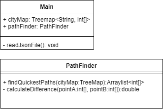

# quickestTrain
this is a train application
## Analyse
Unsere Aufgabenstellung ist wie folgt:  
_Aus einem File werden die Koordinaten eines Startpunkts sowie von einer Serie von zu besuchenden Orten eingelesen. Die Applikation soll dann den kürzesten Weg finden, der vom Startpunkt zu allen Orten und wieder zurück zum Startpunkt führt. Als Distanz jedes Streckenteils wird die Luftlinie zwischen zwei Orten verwendet.  Die beste Reiseroute sollte auf der Konsole und in einem Textfile ausgegeben werden (Liste in der Reihenfolge der besuchten Orte mit Distanz).  Verwenden Sie am Anfang nicht zu viele Orte (vielleicht 5), und erhöhen Sie später. Schätzen Sie zusätzlich zur Codierung das Laufzeitverhalten ihrer Lösung (Protokoll!)_
 
 
## Design
Aus dieser Analyze heraus entstanden grobe Klassendiagramme und ein Use Case Diagram: 

 

 
Mit den Anforderungen wird eine simple Konsolen Applikation reichen. Sobald ein Startpunkt gewählt ist, passiert der Rest im Hintergrund. 

